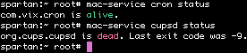

mac-service
===========

`service`-like frontend for launchd, for people who've spent too long doing
CentOS system administration. And for everyone else too.

How to use
----------

### Listing services

List non-Apple services:

```bash
mac-service list
```


List all services:

```bash
mac-service list-all
```


### Controlling services

Start a service:

```bash
mac-service ssh-agent start
```


Restart a service:

```bash
mac-service ssh-agent restart
```


Stop a service:

```bash
mac-service ssh-agent stop
```


### Service info

Show a service's status:

```bash
mac-servce ssh-agent status
```


